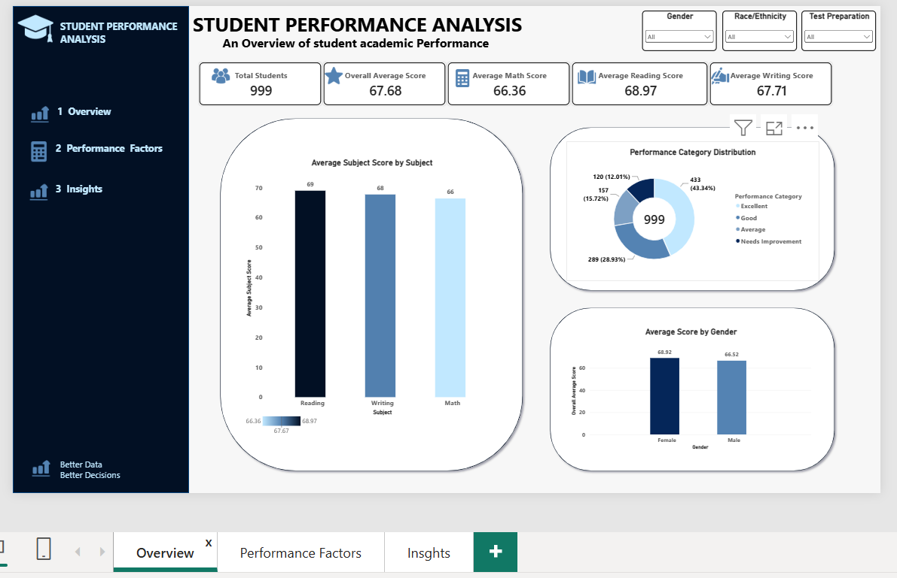
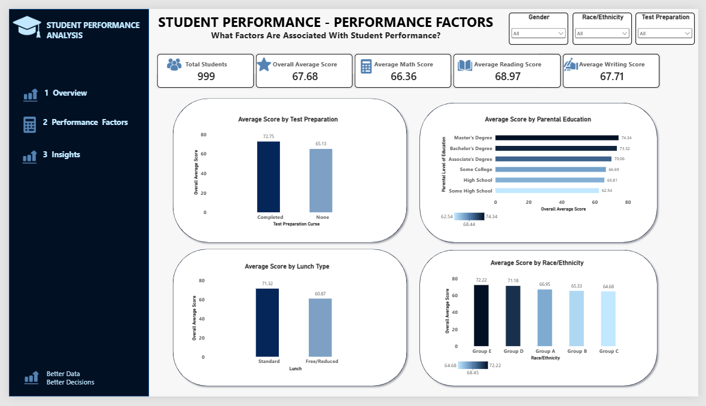
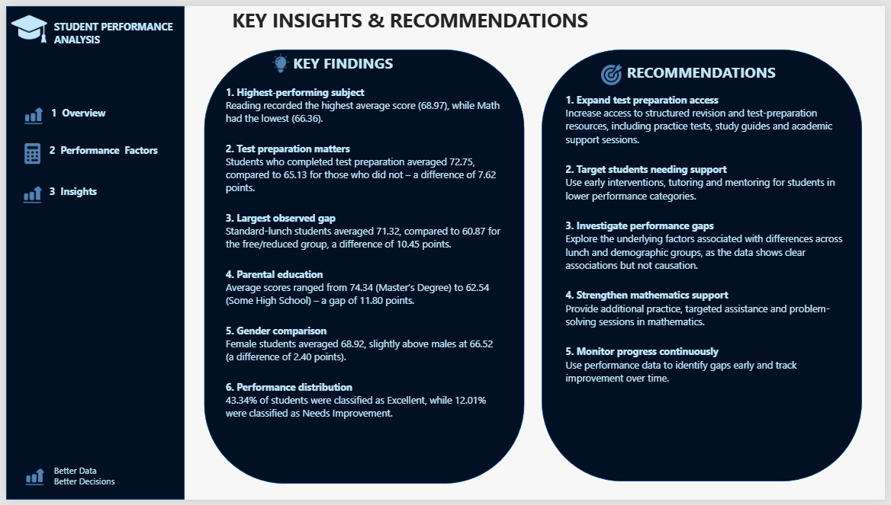

# Student Performance Analysis

## 📊 Project Overview

This project was completed as part of my **Data Analysis Internship with Syntecxhub**.

The project focuses on analyzing student exam performance to identify patterns, compare performance across different factors, and turn the findings into practical recommendations.

I used **Excel Power Query** for data cleaning and transformation, and **Power BI** for analysis, visualization, dashboard development, and data storytelling.

The goal was not just to create charts, but to understand what the data was saying and communicate those insights in a clear and meaningful way.

---

## 🎯 Project Objective

The main objective of this project was to analyze student performance and identify patterns across:

- Overall student performance
- Math, Reading, and Writing scores
- Performance categories
- Gender
- Test preparation
- Lunch type
- Parental education
- Race/Ethnicity

The analysis was presented through an interactive **3-page Power BI dashboard**.

---

## 🛠️ Tools Used

- **Microsoft Excel**
- **Excel Power Query**
- **Power BI**
- **DAX**

---

## 🧹 Data Cleaning & Preparation

The original student performance dataset was cleaned and transformed using **Excel Power Query**.

The cleaning process included:

- Reviewing the dataset structure
- Checking and correcting data types
- Checking for missing or inconsistent values
- Removing duplicate records where necessary
- Transforming and preparing the data for analysis
- Creating required calculated fields
- Loading the cleaned dataset into Power BI

The final cleaned dataset was saved as an Excel workbook:

**`student_performance_cleaned.xlsx`**

---

## 📈 Dashboard Structure

### Page 1 — Overview

The Overview page provides a high-level summary of student performance.

**KPI Cards:**

- Total Students
- Overall Average
- Math Average
- Reading Average
- Writing Average

**Visualizations:**

- Average Score by Subject
- Performance Category Distribution
- Average Score by Gender

---

### Page 2 — Performance Factors

This page explores how student performance varies across different factors.

**Visualizations:**

- Test Preparation vs Average Score
- Parental Education vs Average Score
- Lunch Type vs Average Score
- Race/Ethnicity vs Average Score

**Slicers:**

- Gender
- Race/Ethnicity
- Test Preparation

These interactive filters allow users to explore different segments of the dataset.

---

### Page 3 — Insights & Recommendations

The final page translates the analysis into key findings and practical recommendations.

It focuses on answering the question:

> **What can we learn from the data, and how can these insights support better student outcomes?**

---

## 🖥️ Dashboard Preview

### Page 1 — Overview



### Page 2 — Performance Factors



### Page 3 — Insights & Recommendations



---

## 🔎 Key Findings

### 1. Reading had the highest average score

- **Reading:** 68.97
- **Writing:** 67.71
- **Math:** 66.36

Reading had the highest average score, while Math had the lowest. However, the difference between the subjects was relatively small, showing that overall performance was fairly balanced.

---

### 2. Students who completed test preparation performed better

- **Completed test preparation:** 72.75
- **No test preparation:** 65.13
- **Difference:** 7.62 points

Students who completed test preparation recorded a higher average score than those who did not.

This suggests that structured preparation may be an important area to explore when supporting student performance.

---

### 3. Lunch type showed one of the largest observed performance gaps

- **Standard lunch:** 71.32
- **Free/Reduced lunch:** 60.87
- **Difference:** 10.45 points

This was one of the largest observed differences in the dataset.

Rather than assuming lunch type itself caused the difference, this finding highlights the need to investigate broader contextual factors that may be associated with student performance.

---

### 4. Parental education showed a noticeable performance range

- **Master's Degree:** 74.34
- **Bachelor's Degree:** 73.32
- **Associate's Degree:** 70.06
- **Some College:** 66.69
- **High School:** 65.81
- **Some High School:** 62.54

The observed difference between the highest and lowest groups was **11.80 points**.

This pattern may provide an opportunity for further investigation into the wider educational and learning environment surrounding students.

---

### 5. Female students had a slightly higher average

- **Female:** 68.92
- **Male:** 66.52
- **Difference:** 2.40 points

Female students recorded a slightly higher average score in the dataset, although the difference was relatively modest.

---

### 6. Most students were categorized as Excellent

The performance distribution showed:

- **Excellent:** 43.34%
- **Average:** 28.93%
- **Good:** 15.72%
- **Needs Improvement:** 12.01%

Overall, **59.06%** of students were categorized as Excellent or Good, while **40.94%** were categorized as Average or Needs Improvement.

This highlights the importance of targeted support for students who may require additional academic assistance.

---

## 💡 Recommendations

Based on the analysis, the following recommendations were developed:

### 1. Expand Test Preparation Access

Provide more students with access to structured revision, practice, and test preparation resources.

### 2. Target Students Needing Support

Identify students in the Average and Needs Improvement categories and provide targeted tutoring, mentoring, or early intervention.

### 3. Investigate Performance Gaps

Explore the contextual factors behind the observed differences across lunch type, parental education, and other student groups.

### 4. Strengthen Mathematics Support

Since Math recorded the lowest subject average, additional practice, feedback, and learning support could be considered.

### 5. Monitor Progress Continuously

Track student performance over time to identify improvement, emerging gaps, and areas that may require additional intervention.

---

## ⚠️ Analytical Note

This analysis identifies **patterns and associations within the dataset, but it does not establish causation**.

For example, the observed differences associated with test preparation, lunch type, parental education, gender, and race/ethnicity should not be interpreted as proof that any single factor directly caused differences in student performance.

Additional contextual data would be required to investigate the underlying causes of these patterns.

---

## 🧠 Skills Demonstrated

Through this project, I demonstrated skills in:

- Data Cleaning
- Excel Power Query
- Data Transformation
- Microsoft Excel
- Power BI
- DAX
- Data Visualization
- Dashboard Development
- KPI Development
- Data Analysis
- Data Storytelling
- Insight Generation
- Analytical Thinking
- Recommendation Development

---

## 📁 Project Structure

```text
syntecxhub_student_performance_analysis/
│
├── data/
│   └── student_performance_cleaned.xlsx
│
├── dashboard/
│   ├── overview_dashboard.png
│   ├── performance_factors_dashboard.png
│   └── insights_dashboard.png
│
├── powerbi/
│   └── student_performance_analysis.pbix
│
├── presentation/
│   └── student_performance_analysis_presentation.pptx
│
└── README.mdv
